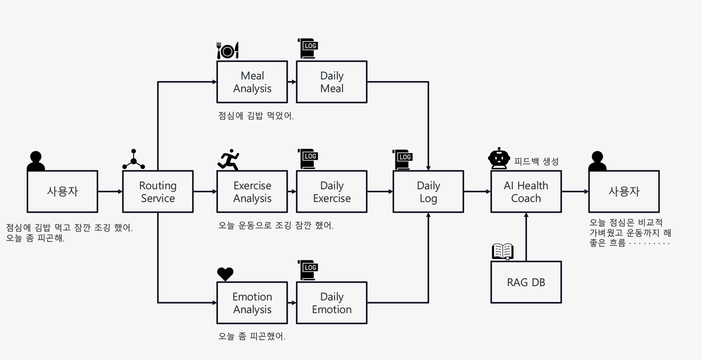
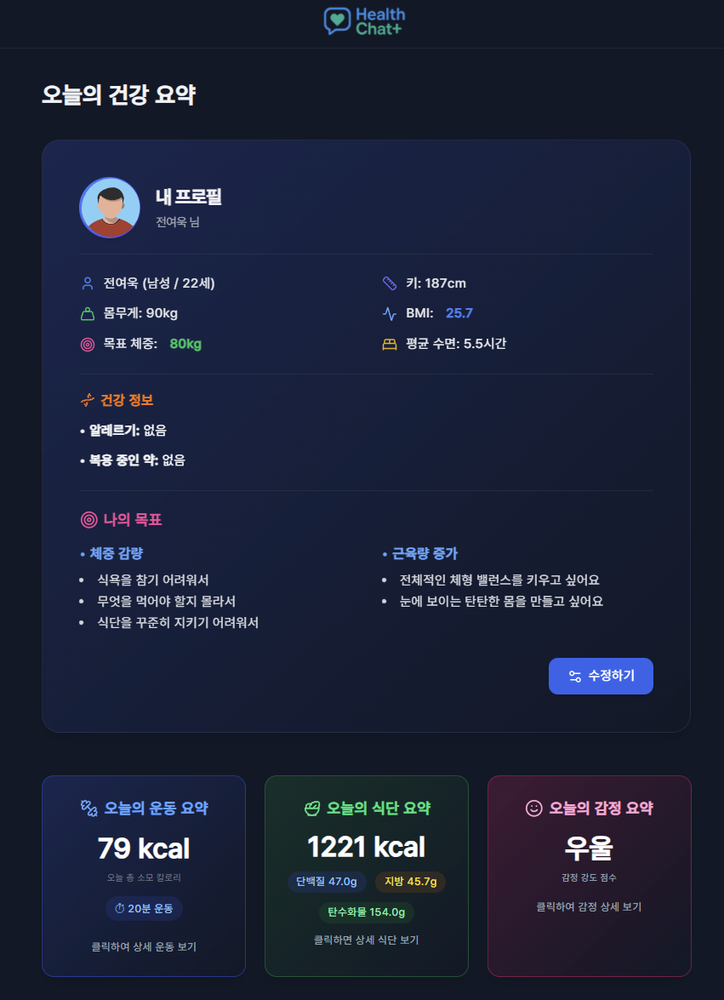
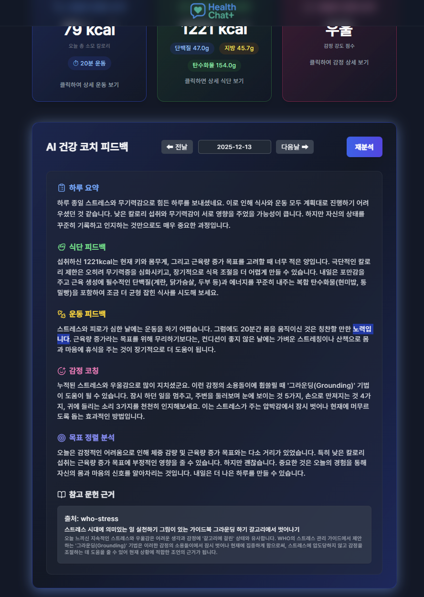
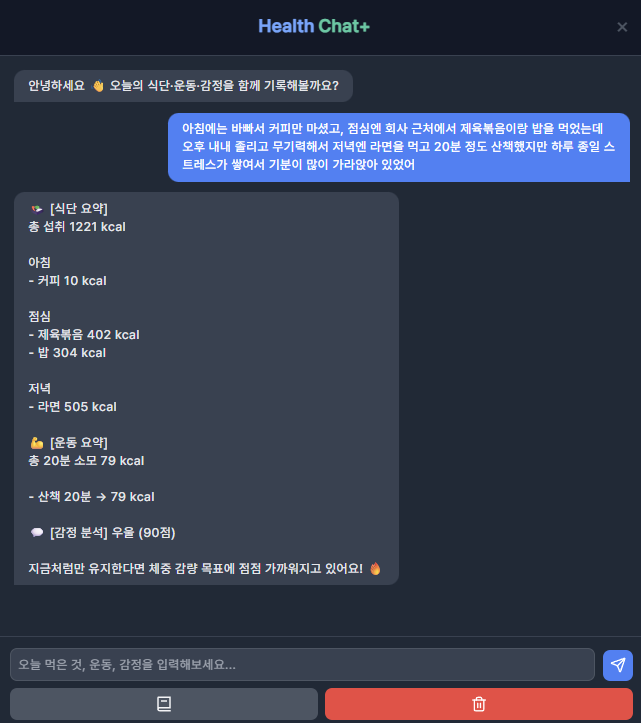

# HealthChat+ 🩺💬  
AI 기반 초개인화 건강 코치 플랫폼 (Natural Language → Structured Log → Evidence-based Feedback)

  

  <a href="http://52.78.215.10/login"><b>🔗 배포 링크</b></a> •
  <a href="https://www.youtube.com/watch?v=QBMxtf1YZhg"><b>🎬 시연 영상</b></a> •
  <a href="https://github.com/Jeon03/healthchat-plus"><b>💻 Repository</b></a>

---

## 한 줄 소개 (One-liner)
**자연어 한 줄 입력 → 식단·운동·감정 자동 구조화 → 근거 기반 초개인화 피드백 제공**

예:  
> “아침에 김밥 먹고 점심엔 라면 2개, 저녁에 30분 뛰었어. 오늘 좀 우울했어.”  
→ AI가 식단/운동/감정을 분리·분석하고 **Daily Log**로 통합 후 코칭 생성

---

## 기획 의도 (Problem → Goal)
기존 건강 관리 서비스는
- 기록 형식이 복잡해 **꾸준히 사용하기 어렵고**
- AI 피드백이 있어도 **근거가 부족해 신뢰하기 어렵다**는 한계가 있습니다.

HealthChat+는 이를 해결하기 위해 아래 목표로 기획되었습니다.

### 개발 목표 (Planning Goals)
- **기록 부담 최소화**: 사용자가 앱 형식에 맞춰 쓰지 않아도 자연어 한 문장으로 기록
- **근거 기반 피드백**: WHO/KDCA/KDRI 등 공신력 있는 기준을 근거로 제시
- **초개인화 코칭**: 사용자 프로필(목표/신체/수면/알레르기 등)을 반영한 맞춤 분석
- **하루 단위 통합 관리**: 식단·운동·감정을 **Daily Log** 중심으로 통합

---

## 핵심 기능 (Core Features)
### 🧠 자연어 분석 & 라우팅
- 사용자 입력 문장을 **식단/운동/감정 영역으로 자동 분리**
- Gemini API 기반 **구조화(JSON 변환)**
- 누락/불완전 입력에 대한 **fallback 로직**

### 🍽 식단 · 🏃 운동 · ❤️ 감정 분석
- 식단: 음식명 및 섭취 맥락 분석
- 운동: 종류/시간/강도 기반 활동 분석
- 감정: 감정 카테고리 및 상태 분석

### 📒 일일 로그(Daily Log) 통합
- 식단·운동·감정을 **하루 단위로 통합 저장**
- 날짜별 조회 및 수정
- 대시보드용 집계 데이터 생성

### 🤖 AI Health Coach (근거 기반 피드백)
- Daily Log 기반 종합 요약/코칭 생성
- WHO·KDCA·KDRI 등 기준을 **RAG DB로 참조**하여 근거 제시
- 목표 기반 개선 방향 제안

### 👤 사용자 프로필(초개인화)
- 키/몸무게/목표/수면/알레르기 설정
- 프로필 기반 개인화 분석 반영

---

## 시스템 아키텍처 (Architecture)

  

- **Routing Service**가 자연어 입력을 식단·운동·감정 분석 서비스로 분기
- 분석 결과를 **Daily Meal / Daily Exercise / Daily Emotion**으로 저장
- **Daily Log**로 통합 후 **AI Health Coach**가 종합 피드백 생성
- WHO·KDRI 등 문헌은 **RAG DB**를 통해 근거 기반 참조

---

## 기술 스택 (Tech Stack)
- **Frontend**: React, TypeScript, Tailwind CSS  
- **Backend**: Spring Boot, MySQL  
- **AI/ML**: Gemini API  
- **Infra**: AWS EC2, Docker, Git  

---

## 스크린샷 (Screenshots)
### 📸 대시보드 메인 화면

### 📸 AI 분석 결과 & 근거 기반 피드백

### 📸 자연어 입력 기반 하루 로그

---

## 시연 영상 (Demo)
- 🎬 YouTube: https://www.youtube.com/watch?v=QBMxtf1YZhg  
- (선택) 포트폴리오 페이지 내 mp4 재생: `assets/demo_web.mp4`

> GitHub README에서는 mp4가 환경에 따라 미리보기 제한이 있을 수 있어  
> YouTube 링크를 기본 제공하도록 구성했습니다.

---

## 배포 (Deployment)
- **AWS EC2**
- **Docker 기반 컨테이너 실행**
- 환경 변수(.env) 분리 및 시크릿 관리

배포 링크: http://52.78.215.10/login

---

## 트러블슈팅 (Troubleshooting)
1) **JSON 파싱 실패 / 형식 불안정 대응**  
- LLM 응답 규격 이탈 대비: fallback + 원문 로그 기록

2) **null 데이터(운동/식단 미입력) 예외 처리**  
- 단계별 null-safe 처리 + “입력 없음” 상태를 UX로 명확히 표현

3) **근거 문헌 연결 UX 개선**  
- 단순 링크 나열이 아니라 “피드백 문장 ↔ 근거”를 함께 보여주는 구조로 개선

---

## 성과 & 회고 (Results & Retrospective)
- 식단·운동·감정 **통합 분석 파이프라인 자동화**
- **근거 기반 피드백(참고문헌 노출)**로 신뢰도/설명력 강화
- 자연어 입력 UX로 **기록 허들 감소**

### Future Work
- 피드백 엔진을 더 세밀한 기준/상황별 로직으로 고도화
- 감정 분석 카테고리/강도 스코어링 정교화
- 선제적 추천(상황 감지 후 행동 제안) 기능 확장
- 주/월 리포트(통계) 기능 추가 및 데이터셋 기반 재현성 강화

---

## Contact
- Email: [jeonyu2589@naver.com](mailto:jeonyu2589@naver.com)  
- GitHub: https://github.com/Jeon03
